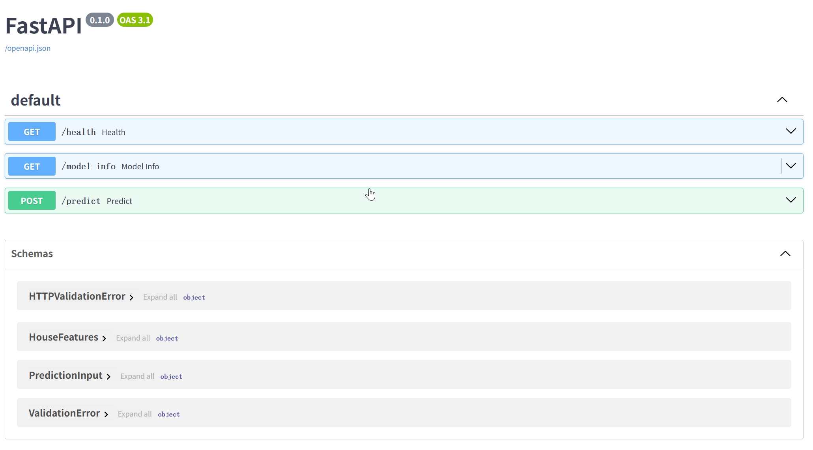
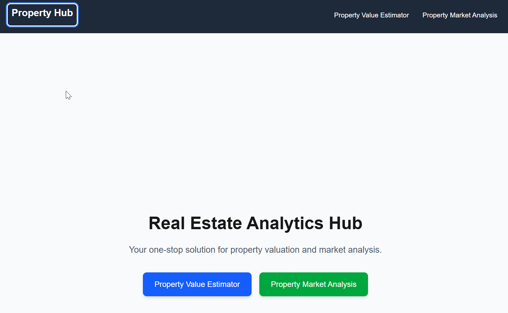

# Property Portal System

A comprehensive property management and analysis system consisting of three integrated components: a machine learning-powered property value estimator, a full-stack web portal, and a cloud architecture design.

## System Overview

This project demonstrates a complete property technology solution with:

- **Task 1**: Property Value Estimator - ML-powered Python backend for property valuation
- **Task 2**: Property Portal Web Application - Full-stack application with Next.js frontend and Java backend
- **Task 3**: Cloud Architecture Design - Scalable AWS-based infrastructure design

## Architecture Integration

The system components work together as follows:
- **Task 1** (Python ML API) serves as the backend for **Task 2's** Property Value Estimator feature
- **Task 2** provides a complete web portal with property market analysis and value estimation
- **Task 3** outlines the production-ready cloud infrastructure for deploying the entire system

## Quick Demonstration

Here's a visual overview of the Property Portal system in action:

### Task 1: FastAPI ML Backend Interface

*FastAPI Swagger UI showing the property value prediction endpoints*

### Task 2: Property Portal Web Application

#### Property Value Estimator Frontend

*Property Value Estimator input form for property characteristics*


*Property Value Estimator results and prediction display*

#### Property Market Analysis Backend

*Property Market Analysis dashboard overview*


*Market analysis data table with detailed property information*


*Market analysis interface showing trends and analytics*

### Complete Portal Overview

*Complete Property Portal system interface*

---

## Task 1: Property Value Estimator (Python ML Backend)

A machine learning API that provides property value predictions based on various property characteristics.

### Features
- Single and batch property value predictions (send a top-level JSON array; use a single-element array for single prediction)
- RESTful API with FastAPI
- Swagger UI documentation
- Health and model info endpoints

### Setup and Running (localhost:8000)

1. **Navigate to task1 directory:**
   ```bash
   cd task1
   ```

2. **Train the model:**
   ```bash
   python train.py
   ```

3. **Build the Docker image:**
   ```bash
   docker build -t task1 .
   ```

4. **Run the Docker container:**
   ```bash
   docker run -p 8000:80 task1
   ```

5. **Access the API:**
   - Swagger UI: http://localhost:8000/docs
   - Health check: http://localhost:8000/health
   - Model info: http://localhost:8000/model-info

### API Usage Examples

**Health Check:**
```bash
curl -X GET http://localhost:8000/health
```

**Model Information:**
```bash
curl -X GET http://localhost:8000/model-info
```

**Single Property Prediction (send a single-element array):**
```bash
curl -X POST http://localhost:8000/predict \
  -H "Content-Type: application/json" \
  -d '[{
    "square_footage": 2000,
    "bedrooms": 3,
    "bathrooms": 2.5,
    "year_built": 2010,
    "lot_size": 8000,
    "distance_to_city_center": 5.2,
    "school_rating": 8.5
  }]'
```

**Multiple Properties Prediction:**
```bash
curl -X POST http://localhost:8000/predict \
  -H "Content-Type: application/json" \
  -d '[
    {
      "square_footage": 2000,
      "bedrooms": 3,
      "bathrooms": 2.5,
      "year_built": 2010,
      "lot_size": 8000,
      "distance_to_city_center": 5.2,
      "school_rating": 8.5
    },
    {
      "square_footage": 1500,
      "bedrooms": 2,
      "bathrooms": 2.0,
      "year_built": 2015,
      "lot_size": 6000,
      "distance_to_city_center": 3.8,
      "school_rating": 9.0
    }
  ]'
```

---

## Task 2: Property Portal Web Application

A full-stack web application providing property market analysis and value estimation capabilities.

### Components

#### Frontend - Next.js Web Portal (localhost:3000)
- Modern React-based web interface
- Property Value Estimator (integrates with Task 1)
- Property Market Analysis dashboard
- Responsive design with Tailwind CSS

#### Backend - Java Spring Boot API (localhost:8080)
- Property Market Analysis API
- Historical market data
- Market trends and forecasts
- Market comparison tools

### Setup and Running

#### Frontend Setup (localhost:3000)

1. **Navigate to task2 directory:**
   ```bash
   cd task2
   ```

2. **Install dependencies:**
   ```bash
   npm install
   ```

3. **Run the development server:**
   ```bash
   npm run dev
   ```

4. **Access the web portal:**
   - Web application: http://localhost:3000

#### Java Backend Setup (localhost:8080)

1. **Navigate to backend-java directory:**
   ```bash
   cd task2/backend-java
   ```

2. **Build the Docker image:**
   ```bash
   docker build -t property-market-analysis .
   ```

3. **Run the Docker container:**
   ```bash
   docker run -p 8080:8080 property-market-analysis
   ```

4. **Access the API:**
   - Base URL: http://localhost:8080/api/market-analysis
   - Health check: http://localhost:8080/api/market-analysis/health

### Integration Notes

The Property Portal integrates both backends:
- **Property Value Estimator**: Uses Task 1 Python API (localhost:8000) for ML-powered property valuations
- **Property Market Analysis**: Uses Task 2 Java API (localhost:8080) for market data and trends

### Java API Endpoints

| Method | Endpoint | Description |
|--------|----------|-------------|
| POST | `/api/market-analysis` | Get comprehensive market analysis |
| GET | `/api/market-analysis/historical` | Get historical market data |
| GET | `/api/market-analysis/trend` | Get current market trend |
| POST | `/api/market-analysis/compare` | Compare markets across locations |
| GET | `/api/market-analysis/forecast` | Get market forecast |
| GET | `/api/market-analysis/health` | Health check endpoint |

---

## Task 3: Cloud Architecture Design

A comprehensive AWS-based cloud architecture design for deploying the Property Portal system at scale.

### Overview
The architecture document outlines a production-ready deployment strategy using AWS services with focus on:
- Scalability and high availability
- Security and compliance
- Cost optimization
- DevOps best practices

### Key Components
- **Frontend**: Next.js on Vercel or S3/CloudFront
- **Backend Services**: ECS/EKS with Auto Scaling
- **Databases**: Aurora (PostgreSQL) and DynamoDB
- **ML Services**: SageMaker for model deployment
- **Security**: WAF, Shield, Cognito authentication
- **Monitoring**: CloudWatch, X-Ray, centralized logging

### Documentation
Detailed architecture specifications and diagrams are available in:
- `task3/architecture.md` - Complete architecture documentation
- `task3/t3.drawio.png` - Architecture diagram

---

## Quick Start Guide

To run the complete system locally:

1. **Start Task 1 (Property Value Estimator):**
   ```bash
   cd task1
   docker build -t task1 .
   docker run -p 8000:80 task1
   ```

2. **Start Task 2 Java Backend (Market Analysis):**
   ```bash
   cd task2/backend-java
   docker build -t property-market-analysis .
   docker run -p 8080:8080 property-market-analysis
   ```

3. **Start Task 2 Frontend (Web Portal):**
   ```bash
   cd task2
   npm install
   npm run dev
   ```

4. **Access the applications:**
   - Web Portal: http://localhost:3000
   - Property Value API: http://localhost:8000/docs
   - Market Analysis API: http://localhost:8080/api/market-analysis/health

## System Requirements

- **Docker**: For containerized services
- **Node.js 18+**: For Next.js frontend
- **Python 3.8+**: For ML backend
- **Java 21+**: For Spring Boot backend
- **Maven 3.6+**: For Java build process

## Development Notes

- The frontend automatically connects to both backend services
- CORS is configured for local development
- All services include health check endpoints
- Swagger documentation available for both APIs