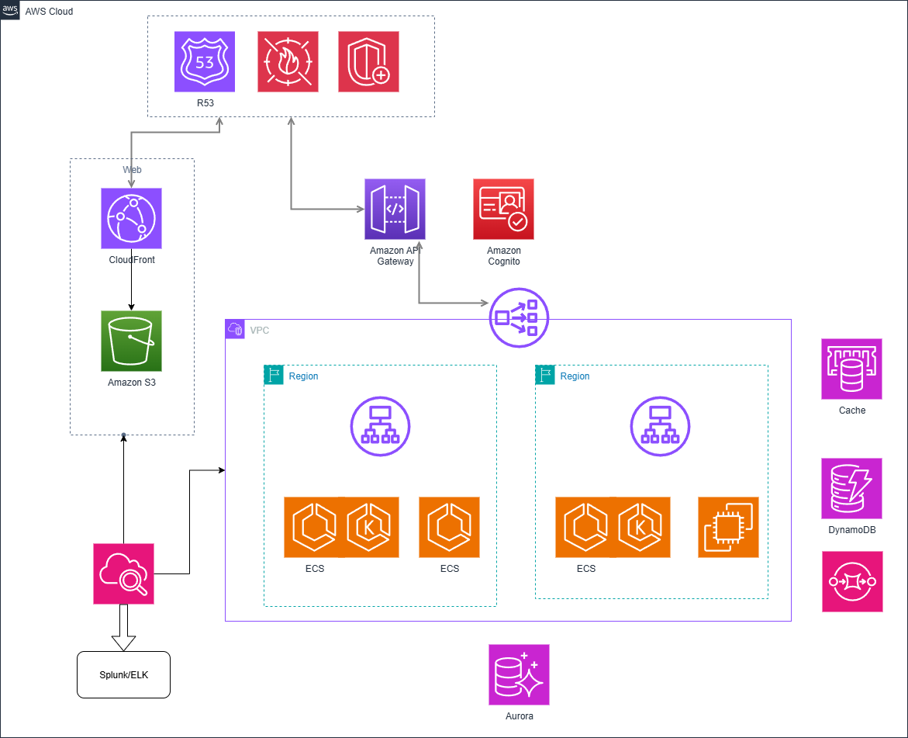

# Cloud Architecture for Property Portal

This document outlines the proposed cloud architecture for the Property Portal system. It combines the original hybrid-cloud approach with AWS-centric operational details for production-ready deployments.

## 1. Cloud Infrastructure

We propose AWS as the primary cloud provider with optional on-premise integration where needed. Key components and design choices:

- Network and edge
    - Route 53 for DNS and global traffic routing.
    - AWS WAF and AWS Shield for web application protection and DDoS mitigation.

- Web / Static assets
    - Amazon S3 for object storage of property images and static assets.
    - Amazon CloudFront (CDN) in front of S3 (and other endpoints) for global caching and low-latency delivery.

- Frontend
    - Next.js application (recommended on Vercel for developer DX) or hosted via S3 + CloudFront for static deployments.

- Services / Backend
    - API entry: Amazon API Gateway as the public API surface, integrated with Amazon Cognito for authentication and authorization.
    - Compute options: Amazon ECS (Fargate), Amazon EKS (managed Kubernetes), or EC2 for specialized workloads. Choose based on team skillset and operational needs.
    - Traffic routing: ALB (Application Load Balancer) / NLB (Network Load Balancer) for layer-7 / layer-4 routing and cross-region/service-group traffic distribution.
    - Managed building blocks: leverage AWS managed services for databases, NoSQL, cache, messaging (SQS/SNS), and search where applicable.
    - Machine learning: deploy models as separate microservices (SageMaker or containers on ECS/EKS) to isolate ML workloads.

- Datastores
    - Relational: Amazon Aurora (Postgres-compatible) or Amazon RDS for relational needs.
    - NoSQL: Amazon DynamoDB for high-scale, low-latency key-value/document patterns.
    - Cache: Amazon ElastiCache (Redis) for caching and session/state when needed.

- Messaging & decoupling
    - Amazon SQS for reliable queuing and decoupling; SNS for pub/sub/notifications.

- Networking & security
    - Amazon VPC with public and private subnets, NAT gateways, VPC endpoints, and fine-grained security groups.

- Observability & logging
    - Amazon CloudWatch for metrics, logs and alarms; use X-Ray for distributed tracing when needed.
    - Stream CloudWatch Logs to enterprise systems (Splunk or ELK) for long-term retention and advanced analysis.

## 2. Scaling and Data

- Compute scaling
    - Use ECS Service Auto Scaling (or EKS HPA) to scale containers based on CPU/memory or custom metrics.
    - For EC2-backed services, use Auto Scaling Groups (ASGs) with lifecycle hooks and policies.

- Data
    - NoSQL: DynamoDB for workloads that require predictable, single-digit millisecond latency and automatic scaling.
    - Relational: Aurora for enterprise-grade relational workloads with read replicas, failover, and automated backups.
    - Backups & lifecycle: RDS/Aurora automated backups and snapshots; S3 lifecycle rules for object tiering and expiry.
    - Security: encrypt data at rest with KMS, enforce TLS in transit, and apply least-privilege IAM policies.

## 3. CI/CD and Monitoring

- CI/CD
    - GitHub Actions or Jenkins pipelines to build, test, and deploy services and infrastructure.
    - Use Infrastructure-as-Code (Terraform or CloudFormation) for reproducible infrastructure provisioning.
    - Deploy frontend to Vercel (or S3/CloudFront) and backend to ECS/EKS via pipeline stages with automated tests and canary/blue-green deployments where appropriate.

- Monitoring & logging
    - Application Performance Monitoring (APM): Datadog, New Relic, or similar for metrics, traces and dashboards.
    - Centralized logs in CloudWatch; configure log streaming to enterprise Splunk or ELK for retention and deeper analysis.
    - Configure CloudWatch Alarms, dashboards, and integrate with PagerDuty/Slack for alerts.

    ## Architecture diagram

    The following diagram shows the high-level deployment and network layout for the Property Portal:

    

